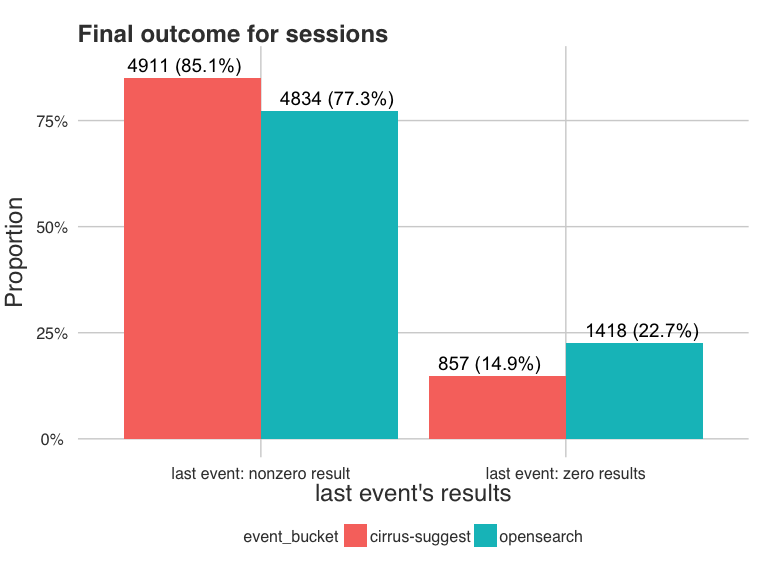

## Introduction

The **completion suggester** is meant to replace prefix searching, with the aim of increasing recall. Completion suggester benefits include: less typos suggested (e.g. if the redirect is close to the canonical title we will display the canonical title), fuzzy searching, and ignoring stop words. The drawbacks of completion suggester are: precision is sometimes very bad because the scoring formula is not well designed for some kind of pages, fuzzy searching can display weird results, and page titles with punctuation or special characters only are not searchable.

## Methods

### Data

On every page load we do a 1 in 10,000 check, and if passed for that one page view then the user gets entered into the test as a control. If the check failed, we do another draw (1 in 9,999) for entering the user into the test as a test subject, with the completion suggester instead of prefix searching.

The events were logged using the [Completion Suggestions](https://meta.wikimedia.org/wiki/Schema:CompletionSuggestions) schema.

### Analysis

We performed the analysis using Bayesian methods for categorical data in the software R using packages and code by Agresti and Min (2005) and Albert (2014). To obtain the posterior multionomial cell probabilities, we implemented the methods of Fienberg and Holland (1973) in a package which we are working on making available.

## Results

### Data Validation

  

### Final Outcome

 

 

                 last event: nonzero result   last event: zero results   sum            
---------------  ---------------------------  -------------------------  ---------------
cirrus-suggest   4911 (40.9%)                 857 (7.1%)                 5768 (48.0%)   
opensearch       4834 (40.2%)                 1418 (11.8%)               6252 (52.0%)   
sum              9745 (81.1%)                 2275 (18.9%)               12020 (100.0%) 

|                      |               |Comment                          |
|:--------------------------|:-------------------|:--------------------------------|
|Bayes Factor               |**VERY** large.     |Very strong evidence against hypothesis of independence. |
|95% C.I. for Difference    |(0.064, 0.091) |Probability of getting nonzero results goes up by 6.4%-9.1% in the suggester group.|
|95% C.I. for Relative Risk |(1.082, 1.120) |Suggester group is 1.1-1.2 times more likely to get nonzero results!|
|95% C.I. for Odds Ratio    |(1.531, 1.846) |Odds of suggester group getting nonzero results are 1.5-1.8 times those of controls!|

### Zero and Nonzero Results Throughout Search Session

 

                 last event: nonzero result   last event: zero results   sum           
---------------  ---------------------------  -------------------------  --------------
opensearch       440 (20.6%)                  1006 (47.1%)               1446 (67.8%)  
cirrus-suggest   126 (5.9%)                   561 (26.3%)                687 (32.2%)   
sum              566 (26.6%)                  1567 (73.4%)               2133 (100.0%) 

Within the search sessions that had both zero results and nonzero results throughout the search session as the user was typing their query:

|                      |               |Comment                          |
|:--------------------------|:-------------------|:--------------------------------|
|Bayes Factor               |**VERY** large.|Very strong evidence against hypothesis of independence. |
|95% C.I. for Difference    |(0.082, 0.157) |Probability of ending up with nonzero results goes up by 8.2%-15.7% in the controls.|
|95% C.I. for Relative Risk |(1.394, 1.981) |Control group is 1.4-2.0 times more likely to end up with nonzero results.|
|95% C.I. for Odds Ratio    |(1.557, 2.433) |Odds of controls ending up with nonzero results are 1.6-2.4 times those with suggester.|

### Whole Session (All-Nonzero vs All-Zero Results)

 

                 nonzero results only   zero results only   sum           
---------------  ---------------------  ------------------  --------------
cirrus-suggest   4785 (48.4%)           296 (3.0%)          5081 (51.4%)  
opensearch       4394 (44.4%)           412 (4.2%)          4806 (48.6%)  
sum              9179 (92.8%)           708 (7.2%)          9887 (100.0%) 

|                      |               |Comment                          |
|:--------------------------|:-------------------|:--------------------------------|
|Bayes Factor               |**VERY** large.|Very strong evidence against hypothesis of independence. |
|95% C.I. for Difference    |(0.017, 0.038) |Probability of having an all-nonzero-results search session goes up by 2%-4% in the suggester group.|
|95% C.I. for Relative Risk |(1.019, 1.042) |Suggester group is 1.02-1.04 is times more likely to have all-nonzero-results session.|
|95% C.I. for Odds Ratio    |(1.298, 1.769) |Odds of suggester having an all-nonzero-results session are 1.3-1.8 times those of controls.|

### German Wikipedia vs English Wikipedia

So far we have looked at the results pooled across the two populations of users. In this section, we look at the outcomes for German Wikipedia and English Wikipedia users separately.

 

#### German Wikipedia

##### Final Outcome

                 last event: nonzero result   last event: zero results   sum           
---------------  ---------------------------  -------------------------  --------------
cirrus-suggest   1225 (40.1%)                 205 (6.8%)                 1430 (46.9%)  
opensearch       1242 (40.7%)                 380 (12.4%)                1622 (53.1%)  
sum              2467 (80.8%)                 585 (19.2%)                3052 (100.0%) 

|                      |               |Comment                          |
|:--------------------------|:-------------------|:--------------------------------|
|Bayes Factor               |**VERY** large.|Very strong evidence against hypothesis of independence|
|95% C.I. for Difference    |(0.063, 0.118) |Probability of getting nonzero results goes up by 6.3%-11.8% for *dewiki* users with the completion suggester.|
|95% C.I. for Relative Risk |(1.081, 1.158) |The *dewiki* test group is 1.1-1.2 times more likely to get nonzero results than controls.|
|95% C.I. for Odds Ratio    |(1.516, 2.204) |Odds of *dewiki* test group getting nonzero results are 1.5-2.2 times those of controls.|

##### Whole Session

                 nonzero results only   zero results only   sum           
---------------  ---------------------  ------------------  --------------
cirrus-suggest   1188 (47.3%)           64 (2.6%)           1252 (49.8%)  
opensearch       1154 (45.9%)           107 (4.3%)          1261 (50.2%)  
sum              2342 (93.2%)           171 (6.8%)          2513 (100.0%) 

|                      |               |Comment                          |
|:--------------------------|:-------------------|:--------------------------------|
|Bayes Factor               |10.878         |Positive evidence against hypothesis of independence. |
|95% C.I. for Difference    |(0.014, 0.054) |Probability of having an all-nonzero-results search session goes up by 1.4%-5.4% in the *dewiki* test group.|
|95% C.I. for Relative Risk |(1.015, 1.059) |The *dewiki* test group is 1.02-1.06 is times more likely to have all-nonzero-results session.|
|95% C.I. for Odds Ratio    |(1.250, 2.367) |Odds of *dewiki* test group having an all-nonzero-results session are 1.3-2.4 times those of controls.|

#### English Wikipedia

##### Final Outcome

                 last event: nonzero result   last event: zero results   sum           
---------------  ---------------------------  -------------------------  --------------
cirrus-suggest   3686 (41.1%)                 652 (7.3%)                 4338 (48.4%)  
opensearch       3592 (40.0%)                 1038 (11.6%)               4630 (51.6%)  
sum              7278 (81.1%)                 1690 (18.9%)               8968 (100.0%) 

|                      |               |Comment                          |
|:--------------------------|:-------------------|:--------------------------------|
|Bayes Factor               |**VERY** large.|Very strong evidence against hypothesis of independence. |
|95% C.I. for Difference    |(0.058, 0.090) |Probability of getting nonzero results goes up by 5.8%-9% for *enwiki* users with the completion suggester.|
|95% C.I. for Relative Risk |(1.074, 1.117) |The *enwiki* test group is 1.07-1.12 times more likely to get nonzero results than controls.|
|95% C.I. for Odds Ratio    |(1.466, 1.820) |Odds of *enwiki* test group getting nonzero results are 1.5-1.8 times those of controls.|

##### Whole Session

                 nonzero results only   zero results only   sum           
---------------  ---------------------  ------------------  --------------
cirrus-suggest   3597 (48.8%)           232 (3.2%)          3829 (51.9%)  
opensearch       3240 (43.9%)           305 (4.1%)          3545 (48.1%)  
sum              6837 (92.7%)           537 (7.3%)          7374 (100.0%) 

|                      |               |Comment                          |
|:--------------------------|:-------------------|:--------------------------------|
|Bayes Factor               |154.272        |Very strong evidence against hypothesis of independence. |
|95% C.I. for Difference    |(0.014, 0.037) |Probability of having an all-nonzero-results search session goes up by 1.4%-3.7% in the *enwiki* test group.|
|95% C.I. for Relative Risk |(1.015, 1.041) |The *enwiki* test group is 1.02-1.04 is times more likely to have all-nonzero-results session.|
|95% C.I. for Odds Ratio    |(1.223, 1.742) |Odds of *enwiki* test group having an all-nonzero-results session are 1.22-1.74 times those of controls.|

## Discussion

## References

Albert, J. (2009, 2014). Bayesian Computation with R. Springer Science & Business Media. http://doi.org/10.1007/978-0-387-92298-0 Accompanying R package: *LearnBayes: Functions for Learning Bayesian Inference* (Version 2.15). URL http://CRAN.R-project.org/package=LearnBayes

Agresti, A., and Min, Y. (2005). Frequentist performance of Bayesian confidence intervals for comparing proportions in 2 x 2 contingency tables. *Biometrics*, **61**(2), 515–523. http://doi.org/10.1111/j.1541-0420.2005.031228.x URL http://www.stat.ufl.edu/~aa/cda/R/bayes/bayes.html

Fienberg, S. E., and Holland, P. W. (1973). Simultaneous estimation of multinomial cell probabilities. Journal of the American Statistical Association, **68**, 683-691. URL http://www.jstor.org/stable/2284799

R Core Team (2015). R: A language and environment for statistical computing. R Foundation for Statistical Computing, Vienna, Austria. URL https://www.R-project.org/.
